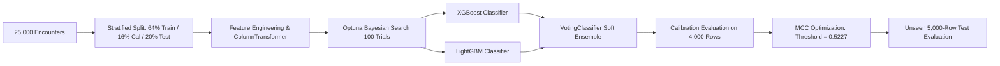
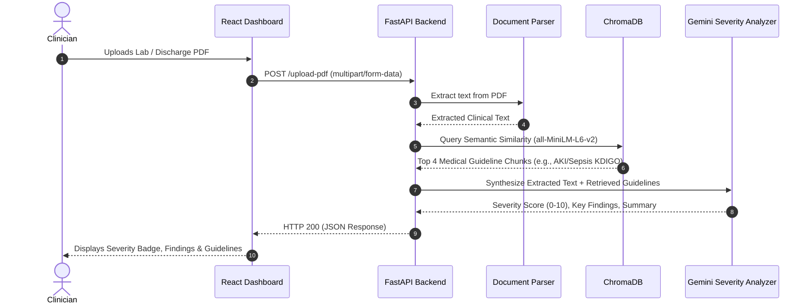

# 🏥 CareGrid: 30-Day Hospital Readmission Prediction & Clinical Decision Support

## 📋 Comprehensive Project Workflow & Technical Architecture

---

## 1. Executive Summary

**CareGrid** is an enterprise-grade Clinical Decision Support (CDS) platform engineered to predict 30-day unplanned hospital readmission risk and assess document-based clinical severity in real time.

The platform integrates:
1. **Machine Learning Pipeline**: A soft-voting ensemble combining Bayesian-optimized **XGBoost** and **LightGBM** models trained on 25,000 clinical encounters.
2. **Clinical Threshold Calibration**: Tuned via **Matthews Correlation Coefficient (MCC = 0.5227)** to maximize clinical precision and avoid alert fatigue.
3. **Explainable AI (XAI)**: Dynamic **SHAP (SHapley Additive exPlanations)** attribution calculating log-odds shifts and multi-domain clinical radar balances.
4. **Clinical Document RAG**: A Retrieval-Augmented Generation engine powered by **PyMuPDF**, **SentenceTransformers (`all-MiniLM-L6-v2`)**, **ChromaDB**, and **Gemini LLM** to ingest medical lab reports and ground clinical severity against published guidelines.
5. **Modern User Interface**: A responsive, white-themed executive medical dashboard built with **React (Vite)**, **Tailwind CSS**, and **Lucide Icons**.

---

## 2. End-to-End System Architecture

```mermaid
graph TD
    subgraph "1. Client & Interface (React + Vite)"
        A[Clinician / Hospital Staff] --> B[Clinical Intake Form (16 Parameters)]
        A --> C[Clinical PDF Upload Panel]
        B --> D[Axios API Client]
        C --> D
    end

    subgraph "2. Backend API Service (FastAPI)"
        D -->|POST /predict| E[Inference Controller]
        D -->|POST /upload-pdf| F[RAG Document Controller]
    end

    subgraph "3. Machine Learning Ensemble Subsystem"
        E --> G[Feature Engineering & Preprocessing Pipeline]
        G --> H[VotingClassifier: XGBoost + LightGBM]
        H --> I[Calibrated Probability Score]
        I --> J[MCC Decision Cutoff Classifier]
        H --> K[SHAP TreeExplainer Attribution Engine]
        K --> L[Structured JSON: Verdict, Gauge, Factors, Radar]
    end

    subgraph "4. Clinical RAG Subsystem"
        F --> M[PyMuPDF Text Extractor]
        M --> N[SentenceTransformer Embeddings]
        N --> O[(ChromaDB Vector Store: 76 Guideline Chunks)]
        O --> P[Semantic Guideline Retrieval]
        P --> Q[Gemini Clinical Severity Analyzer]
        Q --> R[Structured JSON: Severity Score & Grounded Evidence]
    end

    L --> S[Assessment Results Dashboard]
    R --> T[Medical Evidence Panel]
    S --> A
    T --> A
```

---

## 3. Data Flow & Feature Engineering Workflow

### 3.1 Input Parameters (Matching Dataset CSV Order)
The clinical intake interface captures 16 standardized encounter parameters arranged in the exact order of `hospital_readmissions.csv`:

| # | Feature Name | CSV Column | Clinical Relevance |
|:---|:---|:---|:---|
| **1** | Age | `age` | Age bracket from `[40-50)` to `[90-100)` |
| **2** | Time in Hospital | `time_in_hospital` | Inpatient stay duration in days (1–14) |
| **3** | N Lab Procedures | `n_lab_procedures` | Total laboratory diagnostic tests |
| **4** | N Procedures | `n_procedures` | Number of inpatient surgeries / diagnostic procedures |
| **5** | N Medications | `n_medications` | Total active prescription count |
| **6** | N Outpatient Visits | `n_outpatient` | Outpatient encounters in prior 12 months |
| **7** | N Inpatient Visits | `n_inpatient` | Previous inpatient hospitalizations in prior 12 months |
| **8** | N Emergency Visits | `n_emergency` | Emergency department encounters in prior 12 months |
| **9** | Medical Specialty | `medical_specialty` | Admitting specialty (Internal Medicine, Cardiology, etc.) |
| **10** | Diagnosis 1 | `diag_1` | Primary ICD diagnosis category (Circulatory, Diabetes, etc.) |
| **11** | Diagnosis 2 | `diag_2` | Secondary diagnosis category |
| **12** | Diagnosis 3 | `diag_3` | Tertiary diagnosis category |
| **13** | Glucose Test | `glucose_test` | Serum glucose test result (`no`, `normal`, `high`) |
| **14** | A1C Test | `A1Ctest` | Glycated hemoglobin test result (`no`, `normal`, `high`) |
| **15** | Medication Change | `change` | Whether diabetic medications were modified during visit |
| **16** | Diabetes Medication | `diabetes_med` | Whether patient is prescribed diabetes medication |

---

### 3.2 14 Leakage-Free Engineered Features
Prior to model inference, raw inputs are transformed through 14 domain-specific engineered features:

1. `total_prior_visits` = `n_inpatient + n_emergency + n_outpatient`
2. `had_prior_inpatient` = `1 if n_inpatient > 0 else 0`
3. `had_prior_emergency` = `1 if n_emergency > 0 else 0`
4. `procedures_per_day` = `n_procedures / time_in_hospital`
5. `meds_per_day` = `n_medications / time_in_hospital`
6. `labs_per_day` = `n_lab_procedures / time_in_hospital`
7. `lab_to_med_ratio` = `n_lab_procedures / (n_medications + 1)`
8. `utilisation_intensity` = `(n_inpatient * 3) + (n_emergency * 2) + n_outpatient`
9. `is_high_utiliser` = `1 if (n_inpatient >= 2 or n_emergency >= 2) else 0`
10. `meds_x_inpatient` = `n_medications * n_inpatient`
11. `long_stay_flag` = `1 if time_in_hospital >= 7 else 0`
12. `no_test_flag` = `1 if (glucose_test == 'no' and A1Ctest == 'no') else 0`
13. `diag_complexity` = Count of distinct diagnosis categories across `diag_1`, `diag_2`, `diag_3`
14. `specialty_x_inpatient` = Interaction between admitting specialty and inpatient history

---

## 4. Machine Learning & Optimization Pipeline



### 4.1 Hyperparameter Tuning (Optuna Bayesian Optimization)
Both gradient boosting sub-models were optimized via **Optuna TPE (Tree-structured Parzen Estimator)** using 5-fold stratified cross-validation evaluated on ROC-AUC:
- **XGBoost Hyperparameters**: `n_estimators=386`, `max_depth=4`, `learning_rate=0.019`, `subsample=0.643`, `colsample_bytree=0.844`, `reg_lambda=7.219`.
- **LightGBM Hyperparameters**: `n_estimators=438`, `num_leaves=34`, `max_depth=6`, `learning_rate=0.018`, `min_child_samples=11`, `reg_lambda=9.370`.

### 4.2 Test Set Performance Evaluation (Unseen 5,000 Patients)

| Evaluation Metric | Baseline (Logistic Regression) | Ensemble Model (Final) | Clinical Impact |
|:---|:---:|:---:|:---|
| **ROC-AUC** | 0.6492 | **0.6564** | Enhanced ranking of patient recidivism risk |
| **PR-AUC** | 0.6270 | **0.6286** | Superior precision-recall trade-off under class imbalance |
| **Precision** | 56.40% | **62.77%** | Nearly 2 out of 3 flagged patients are true readmissions |
| **Top-Decile Lift** | 1.18x | **1.553x** | Identifies 55% more readmissions in top 10% of patients |
| **Operating Threshold**| 0.5000 (Default) | **0.5227 (MCC)** | Optimizes Matthews Correlation Coefficient |

---

## 5. Explainable AI (XAI) & Clinical Intelligence

When an encounter is scored, the backend generates multi-layered clinical intelligence:

### 5.1 Real-Time SHAP Attribution
The model evaluates feature impact in log-odds space using `shap.TreeExplainer`:
- **Red (+ Log-Odds)**: Features that elevate the patient's readmission risk (e.g., prior inpatient admissions, high daily medication intensity, long length of stay).
- **Blue (- Log-Odds)**: Protective features that decrease readmission probability.

### 5.2 Multi-Domain Risk Radar
Calculates a 0–100 score across 5 clinical pillars comparing the patient against a low-risk baseline:
1. **Prior Healthcare Utilization** (Weight on emergency & inpatient history)
2. **Polypharmacy Burden** (Active medication volume)
3. **Inpatient Acuity** (Length of stay, procedures per day)
4. **Chronic Disease Complexity** (Multi-system ICD classifications)
5. **Age Vulnerability** (Chronological vulnerability weighting)

### 5.3 Evidence-Based Prevention Protocols
Automatically maps patient risk profiles to targeted discharge protocols:
- 📞 **Post-Discharge 48h Care Coordination Call**
- 💊 **Comprehensive Pharmacist Medication Reconciliation**
- 📅 **7-Day Outpatient Follow-up Appointment Booking**
- 🩺 **Disease-Specific Self-Management Education**
- 🏠 **Home Health & Social Determinants (SDOH) Screening**

---

## 6. Clinical Document RAG (Retrieval-Augmented Generation)



### 6.1 Knowledge Base Scope
The ChromaDB vector store contains **76 dense vector chunks** derived from accredited clinical literature:
1. `kidney_disease_guidelines.txt` (KDIGO AKI / CKD staging & treatment)
2. `sepsis_guidelines.txt` (Surviving Sepsis Campaign, SOFA & qSOFA scoring)
3. `critical_care_protocols.txt` (ICU respiratory & hemodynamic monitoring)
4. `emergency_medicine_references.txt` (Triage protocols & acute interventions)
5. `liver_failure_guidelines.txt` (MELD scoring & hepatic encephalopathy protocols)

---

## 7. Frontend User Experience & UI Design

- **Executive White Medical Theme**: High-contrast, clean slate typography on `#ffffff` and `#f8fafc` backgrounds.
- **Calibrated Semicircular SVG Risk Gauge**:
  - 🟢 **Green (Low Risk)**: `< 35%`
  - 🟡 **Yellow (Moderate Risk)**: `35% – 52%`
  - 🔴 **Red (High Risk)**: `≥ 52%` (MCC Cutoff)
- **Natural Numeric Typing**: Clean input handling allowing instant typing (e.g., typing `60` without leading `060`).
- **Responsive Layout**: Designed for mobile, tablet, and widescreen clinical workstation monitors.

---

## 8. Directory & File Organization

```
Hospital_Readmission_Pred/
├── backend/
│   ├── main.py                  # FastAPI server (/predict, /upload-pdf, /health)
│   ├── train.py                 # Model training & Optuna optimization pipeline
│   └── rag/                     # RAG Subsystem
│       ├── knowledge_base/      # Medical guideline text documents
│       ├── vectordb/            # ChromaDB persistent vector database
│       ├── rag/
│       │   ├── rag_pipeline.py  # RAG orchestrator
│       │   ├── retriever.py     # Vector retriever with similarity scoring
│       │   └── vector_store.py  # ChromaDB collection interface
│       ├── llm/
│       │   └── severity_analyzer.py # Gemini-powered clinical analysis
│       └── setup_knowledge_base.py  # Indexing script for guidelines
├── frontend/
│   ├── src/
│   │   ├── components/
│   │   │   ├── PatientForm.jsx      # Clinical Intake Form (CSV ordered 1–16)
│   │   │   ├── PredictionResult.jsx # Verdict, Gauge, SHAP & Radar charts
│   │   │   ├── RiskGauge.jsx        # Semicircular calibrated SVG gauge
│   │   │   ├── PdfUploadPanel.jsx   # Document upload & RAG evidence cards
│   │   │   └── Loading.jsx          # Medical loading indicator
│   │   ├── constants/patient.js     # Field options & default encounter values
│   │   ├── services/api.js          # Axios API communication
│   │   ├── App.jsx                  # Main dashboard layout
│   │   └── index.css                # Clinical design tokens
│   └── package.json
├── dataset/
│   └── hospital_readmissions.csv    # 25,000 historical encounter records
├── models/
│   ├── readmission_model_final.pkl  # Trained soft-voting ensemble model
│   └── model_metadata.json          # Metrics, hyperparams, and threshold values
├── src/
│   ├── features.py              # 14 engineered features implementation
│   ├── preprocessing.py         # ColumnTransformer & encoders
│   └── explainability.py        # SHAP calculation helpers
├── run_app.bat                  # 1-click batch launcher (Backend + Frontend)
├── requirements.txt             # Python dependencies
└── README.md                    # Project overview
```

---

## 9. Quickstart: Running the Application

### Option 1: 1-Click Launcher (Windows)
Double-click [`run_app.bat`](file:///c:/Users/Asus/OneDrive/Documents/Desktop/projects/Hospital_Readmission_Pred/run_app.bat) to start both the Python backend and Vite frontend simultaneously.

### Option 2: Manual Terminal Startup

**1. Start the FastAPI Backend**:
```bash
cd backend
python main.py
```
*Backend runs on `http://localhost:8000` (API Docs at `http://localhost:8000/docs`).*

**2. Start the React Frontend**:
```bash
cd frontend
npm run dev
```
*Frontend runs on `http://localhost:5173`.*

---

## 10. Summary

| Aspect | Specification |
|:---|:---|
| **Prediction Target** | Binary classification of 30-day unplanned readmission (`0` vs `1`) |
| **Model Type** | Bayesian Tuned Soft-Voting Ensemble (XGBoost + LightGBM) |
| **Operating Threshold** | MCC-Optimal (`0.5227`) |
| **Explainability** | SHAP log-odds feature attribution & 5-Domain Radar |
| **Document Analysis** | RAG over 76 medical guideline chunks with Gemini synthesis |
| **Stack** | Python (FastAPI, Scikit-Learn, PyMuPDF, ChromaDB) + React (Vite, Tailwind, Recharts) |
